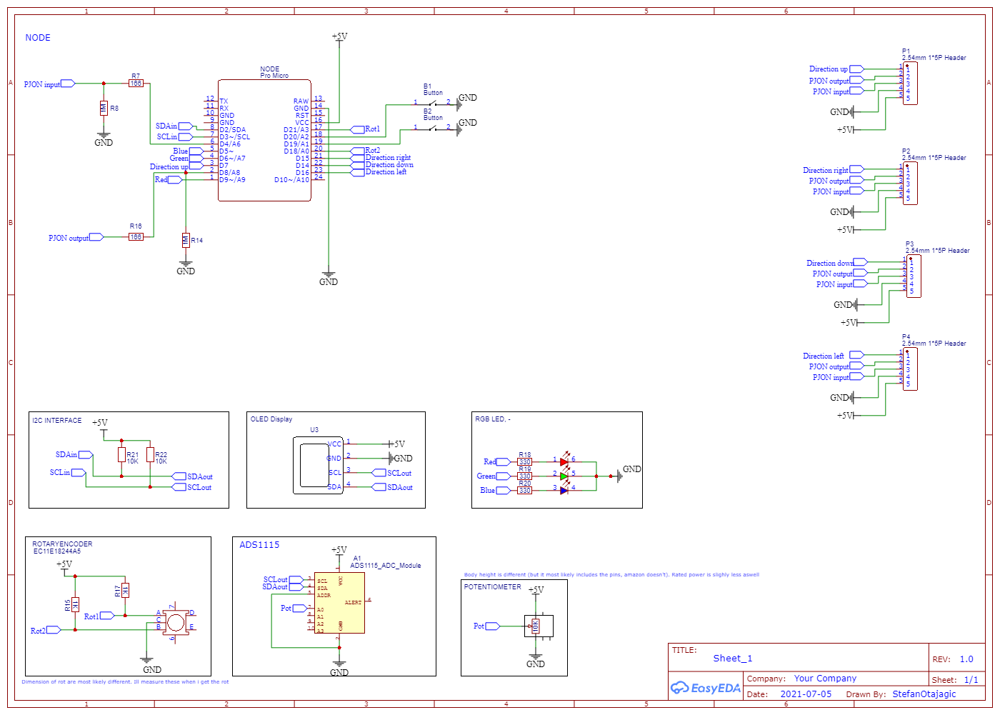

# Physical interface for desdeo framework

A modular physical interface for preference input from decision-maker for solving multiobjective optimization problems and decision making.

<!---
(Currently the nodes communicate with each other using the [PJON software bitbang](https://www.pjon.org/SoftwareBitBang.php) protocol. 
Each node has it's own dynamically assigned unique id which the master is aware of. This allows the master to communicate with a specific node. The master also knows the location and connected components of each node. 

In configuration state (CS) each node is assigned an id by the master and each node sends it basic information to master (atm: How many components of each type it has).
After the CS. The nodes send the values of the components to the master. These values are only sent when a value of a component changes and only that component value is sent along with the node id, component id and type (i.e. [421, 2, 'P', 1] which translates back to [value, node id, component type, component id]). After the master receives such data from a node it will read it and write the values to Serial port which can the be used whenever needed. None of this data is saved to the master so the master doesn't know anything of the nodes. But the other end of Serial should.

After the CS each node check for changes in component values, if a change occurs then the new value is send to the master and from there to Serial. component values can be bounded by a packet from the master which is first received from the Serial.

If a node gets disconnect after the CS a node next to it will notice this immediately and send a packet to the master telling a node from side x of me has disconnected, the master can then pass this information to the serial and the id of the disconnected node can be easily verified if the position of each slave is saved. 

Whenever a node connects it send a message to the master indicating that is has connected. If the configuration state is not done the master will ignore this message, otherwise the master receives the message and runs the configuration again since a new node has connected.

Each node, including the master, has 4 digital pins reserved for each direction (TOP 7, RIGHT 15, BOTTOM 14, LEFT 16) which are used to assign dynamic ids, understand the configuration and check for disconnected nodes. Shortly we go node by node checking each direction, for more details check [direction pins](doc/DirectionPins). 

In addition to direction pins each node also needs 2 digital pins (ATmega32u4 supports pins 2,4,8,12) for communication, in 4/out 8. The master communicates through serial so pins tx/rx should be left empty.

 --->

## Setup libraries
* From [desdeo_interface/ArduinoFiles](desdeo_interface/ArduinoFiles) copy all modules (folders with no sub folders, i.e. CRC8) except UniversalNode to the arduino libraries folder.
    * (TODO: Figure out relative imports)
    * If modifying these files, you must copy the modified file again to the libraries folder (relative would handle this).
* From the arduino library manager install PJON and ADS1X15.
* To install webusb follow the installation guide: [https://github.com/webusb/arduino](https://github.com/webusb/arduino) 
    * Uploading webusb code requires upgrading device USB 2.0 to USB 2.1. This requires changing a line in a header file.
    * (windows) After the upgrade one must include the webusb library in the sketch. Uploading a sketch without the library will cause windows to not recognize the device. To fix this you can upload a sketch from a linux/mac pc. 
* After this you should be able to upload the UniversalNode sketch to a webusb supported board.

## TODO 

### React / javascript
* Reconfiguring resets roles... would be better if it didn't
* Use the states better
* Handle disconnection/quitting
* Handle errors
* Verify node drawing works as intended
* Handle drawing disconnected nodes properly:
    * Instead of outlining just the one that disconnected, outline each one that might of disconnected as well
    because of the disconnection
    * i.e. 3 nodes side by side => master - node 1 - node 2. Say node 1 disconnected then also node 2 disconnects...
* Make it prettier
* Add crc check

### Arduino side
* A set value function for each component might be a good idea
    * How to send these values as we're already sending a struct type without id
* Send pjon struct packets with an id.
    * Currently only sending one struct => it can be identified as it is the only packet without an id
* ADS seems to cause some issues sometimes as getting values takes too long and the node misses receiving data
* Same issue with interrupts so I removed interrupts, you might want to include that again, not sure
    * i.e. Constantly changing rot values will call interrupt function over and over again -> not receiving/sending data.
* Strings to char arrays or something else
* Try to save some memory?

### PCB
Some or actually quite many solders are weak on these prototype pcbs, maybe make them better.
Problems with pcb in image:

